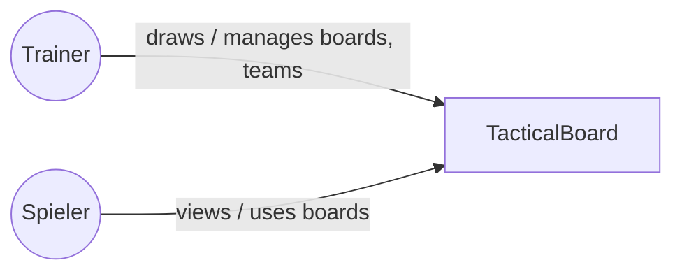
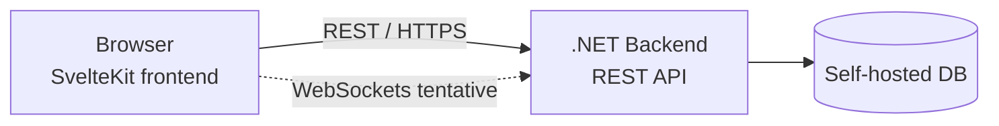

# 3. System Scope and Context

## 3.1 Business Context

Actors interacting with the system:

- **Trainer** (coach)
- **Spieler** (player)

_TBD: how Trainer and Spieler map onto the team roles from chapter 1 (Admin, Bearbeiter, Leser) — not yet decided._

## 3.2 Technical Context

- **Client**: SvelteKit frontend, used in the browser by both Trainer and Spieler.
- **Backend**: .NET, exposing a REST API over HTTPS.
- **Realtime (tentative, not yet decided)**: WebSockets, being considered for realtime use cases (e.g. collaborative board editing).

