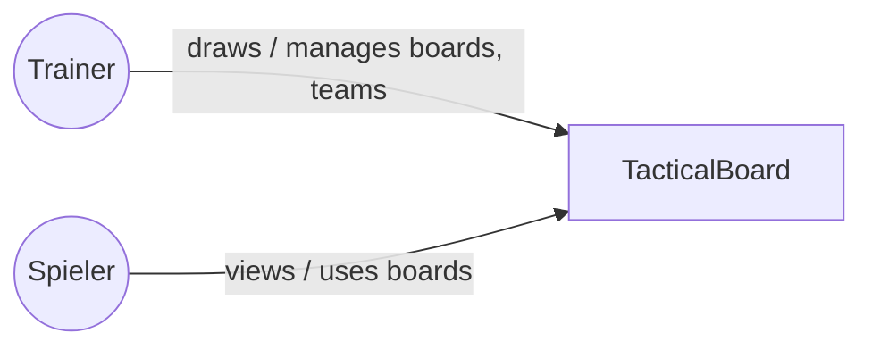
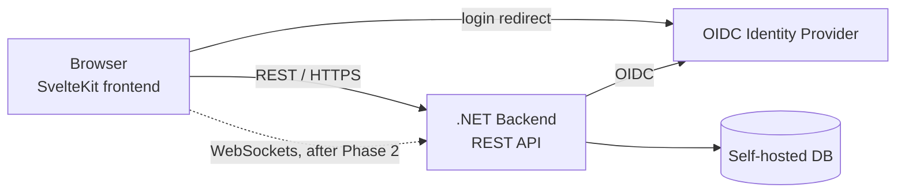

# 3. System Scope and Context

## 3.1 Business Context

Actors interacting with the system:

- **Trainer** (coach)
- **Spieler** (player)

Trainer and Spieler are descriptive actor types only. They are not roles in the system and do not map onto the team roles (Admin, Editor, Reader, see ch. 8).

## 3.2 Technical Context

- **Client**: SvelteKit frontend, used in the browser by both Trainer and Spieler.
- **Backend**: .NET, exposing a REST API over HTTPS. It also handles the login (backend for frontend, see ch. 8.13).
- **Identity Provider**: any OpenID Connect provider; the browser is redirected there to log in.
- **Realtime (after Phase 2)**: WebSockets for realtime use cases (e.g. collaborative editing) come after Phase 2. Phase 2 must not block them (see ADR-010).

