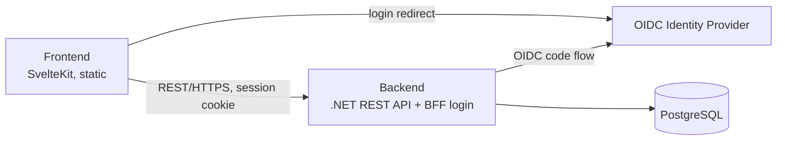
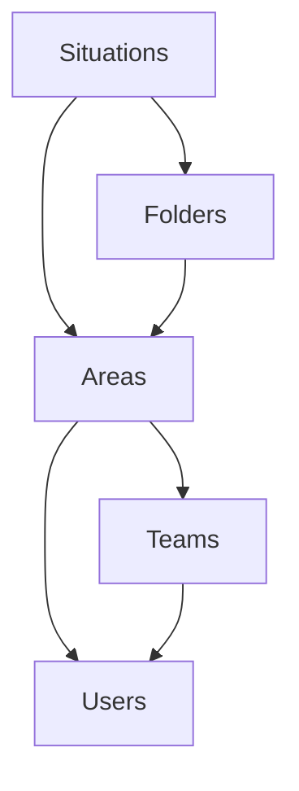

# 5. Building Block View

## 5.1 Whitebox Overall System

| Block | Responsibility |
|---|---|
| Frontend | Renders the tactical board, drives all user interaction (Trainer, Spieler), calls the backend over REST. Works without login in local mode (ch. 1). |
| Backend | Owns business logic and persistence for situations, folders, teams and users; runs the OIDC login and holds the session (ch. 8.13). |
| PostgreSQL | Persists situations (with revisions), folders, teams, memberships, join requests, users. Accessed only through the backend's repository interfaces (ADR-002, ADR-007). |
| Identity Provider | Authenticates users. Any OpenID Connect provider; not part of the app (ADR-003). |

## 5.2 Level 2: Backend Modules

The backend is a modular monolith, decomposed by business domain, not by technical layer. Each module has its domain classes, application services and repository **interfaces**; the EF Core implementations live in an infrastructure part that is wired in by dependency injection (ADR-007).

| Module | Responsibility |
|---|---|
| **Users** | Local user accounts mapped from the IdP identity (issuer + subject), display name, system administrator role, blocking, account deletion, the bootstrap of the first system administrator. Provides the *current user* to the other modules. |
| **Teams** | Teams (name, logo, code), overview and search, join requests, memberships and roles, leaving and deleting teams. Owns the **authorization checks** for team content (`ITeamAuthorization`). |
| **Areas** | The common abstraction for "where situations live": a user's personal area or a team. Answers "may the current user read / write in this area?" by asking Users (personal area: only its owner) or Teams (the role matrix, ch. 8.1). |
| **Folders** | Flat folders inside an area. |
| **Situations** | Situations with their revisions, saving with conflict detection, title uniqueness and default titles, validation of the situation document. |

Dependencies (arrows = "uses"):

- Situations and Folders never check roles themselves; they ask Areas, which delegates to Teams or Users.
- Users depends on no other module. Account deletion needs to know about memberships and personal content: Users publishes the request ("user is about to be deleted" / "user deleted") through an in-process interface that Teams and Areas implement, so the dependency arrows stay as above.
- System administrators reach team management through Teams (with their own authorization rule), never through Situations or Folders, so they can't read content (ch. 8.1).
