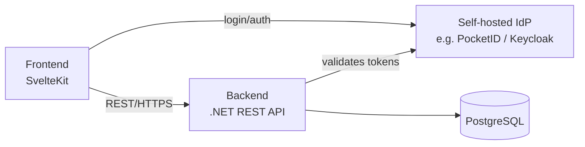

# 5. Building Block View

## 5.1 Whitebox Overall System

| Block | Responsibility |
|---|---|
| Frontend | Renders the tactical board, drives all user interaction (Trainer, Spieler), calls the backend over REST. |
| Backend | Owns business logic and persistence for boards, teams, and folders; validates authentication against the IdP. |
| PostgreSQL | Persists boards, teams, folders, memberships. Accessed only through the backend's data-access abstraction (see ch. 4). |
| Identity Provider | Authenticates users; issues tokens the backend validates. Self-hosted, not built in-house (see ch. 4). |

## 5.2 Level 2: Backend Modules

The backend is decomposed by business domain, not by technical layer:

| Module | Responsibility |
|---|---|
| **Boards** | Board CRUD (save/load/edit/delete on the server), JSON export/import of a board's content. |
| **Folders** | Grouping a team's boards into folders. |
| **Teams** | Team creation, join/leave, membership management, roles (Admin, Bearbeiter, Leser). |
| **Users/Auth** | Local representation of authenticated users; maps tokens from the IdP to app-level identity and team roles. |

_TBD: how these modules depend on each other (e.g. does Folders depend on Boards, does Teams own authorization checks used by Boards/Folders) — to be refined once implementation starts._
