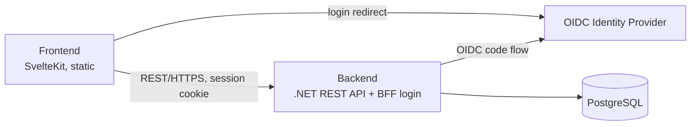
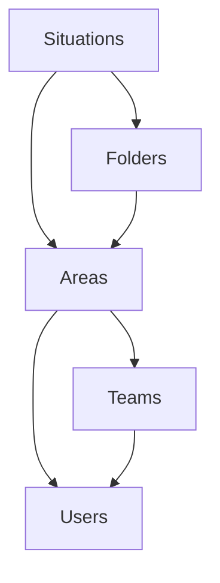

# 5. Building Block View

## 5.1 Whitebox Overall System

| Block | Responsibility |
|---|---|
| Frontend | Renders the tactical board, drives all user interaction (Trainer, Spieler), calls the backend over REST. Works without login in local mode (ch. 1). |
| Backend | Owns business logic and persistence for situations, folders, teams and users; runs the OIDC login and holds the session (ch. 8.13). |
| PostgreSQL | Persists situations (with revisions), folders, teams, memberships, join requests, users. Accessed only through the backend's repository interfaces (ADR-002, ADR-007). |
| Identity Provider | Authenticates users. Any OpenID Connect provider; not part of the app (ADR-003). |

## 5.2 Level 2: Backend Modules

The backend is a modular monolith, decomposed by business domain, not by technical layer. Each module has its domain classes, application services and repository **interfaces**; the EF Core implementations live in an infrastructure part that is wired in by dependency injection (ADR-007).

| Module | Responsibility |
|---|---|
| **Users** | Local user accounts mapped from the IdP identity (issuer + subject), display name, preferred UI language (ch. 8.18), system administrator role, blocking, account deletion, the bootstrap of the first system administrator. Provides the *current user* to the other modules. |
| **Teams** | Teams (name, logo, code), overview and search, join requests, memberships and roles, leaving and deleting teams. Owns the **authorization checks** for team content (`ITeamAuthorization`). |
| **Areas** | The common abstraction for "where situations live": a user's personal area or a team. Answers "may the current user read / write in this area?" by asking Users (personal area: only its owner) or Teams (the role matrix, ch. 8.1). |
| **Folders** | Flat folders inside an area: create, rename (unique names), delete (only when empty). Tells Situations which area a folder belongs to. |
| **Situations** | Situations with their revisions, saving with conflict detection, title uniqueness and default titles, validation of the situation document. |

Dependencies (arrows = "uses"):

- Situations and Folders never check roles themselves; they ask Areas, which delegates to Teams or Users.
- Folders must not use Situations (the arrow points the other way), yet a folder may only be deleted while it contains no situations. Folders therefore defines the question as an interface in its contracts (`IFolderContents`), and Situations implements it (dependency inversion); the same contract counts the situations per folder for the folder list; the check and the deletion share one database transaction with Situations' writes (ADR-012).
- Users depends on no other module. Account deletion needs to know about memberships and personal content: Users publishes the request ("user is about to be deleted" / "user deleted") through an in-process interface that Teams and Areas implement, so the dependency arrows stay as above.
- Teams may not use Areas, Folders or Situations, yet deleting a team deletes its folders and situations. The same pattern: Teams publishes the deletion through its contract `ITeamDeletionParticipant` (called inside the deleting transaction); Areas implements it and passes it on, as "the team's area goes away", to its own contract `IAreaContentDeletion`, which Folders and Situations implement (roadmap step 8). So each module only implements a contract of a module it may use (ADR-015).
- System administrators reach team management through Teams (with their own authorization rule), never through Situations or Folders, so they can't read content (ch. 8.1).

### Implementation (`backend/`)

One .NET solution (`backend/TacticalBoard.slnx`), **one project per module**, so the dependency arrows above are enforced by the compiler:

| Project | Content |
|---|---|
| `src/TacticalBoard.SharedKernel` | Abstractions every module's domain code may use, with no framework dependency: `IClock`, `IIdGenerator`, `DomainException` (+ `DomainErrorKind`, `ErrorCode`), `FieldError` / `FieldErrors` (validation problems with stable codes, ch. 8.2), `ISoftDeletable` / `SoftDeletableEntity`, `IUnitOfWork` (one transaction across modules, ADR-012), `UniqueNames` (how unique names are compared: titles, folder names). |
| `src/TacticalBoard.Infrastructure` | Shared technical plumbing: `SystemClock`, `SequentialGuidGenerator` (UUID v7), the one EF Core context `TacticalBoardDbContext` with the soft-delete query filter and interceptor (ch. 8.16), `EfUnitOfWork` (transactions on that context), migration on startup, and the module contract `IModule`. |
| `src/Modules/TacticalBoard.{Users,Teams,Areas,Folders,Situations}` | One project per module. Teams also references SkiaSharp for its logo images (ADR-014). Each references only the modules it may use (above); transitive project references are switched off (`src/Modules/Directory.Build.props`), so e.g. Situations can't use Users or Teams. |
| `src/TacticalBoard.Api` | The host: composes the modules (`Hosting/ModuleCatalog`, `Hosting/ApiHost`), Problem Details (ch. 8.2), `GET /api/health`, the login as BFF (`Authentication/`: cookie session, OIDC, antiforgery, `/auth/*`, ch. 8.13), configuration, and the EF Core migrations (`Persistence/Migrations`; only the host knows every module's part of the model). The host talks to the Users module only through its `Contracts` (`IUserAuthentication`). |

Conventions inside a module project (folders are created as the module gets content):

- `<Module>Module` (implements `IModule`) registers the module's services and maps its endpoints below `/api`. It is the only public type besides the `Contracts` namespace.
- `Contracts/`: the public interfaces and DTOs other modules may use (e.g. the current user, `ITeamAuthorization`). Everything else is `internal`.
- `Domain/`, `Application/`: entities, domain services, application services and repository interfaces; they depend only on SharedKernel abstractions and other modules' contracts, never on EF Core, Npgsql or ASP.NET Core.
- `Infrastructure/`: EF Core entity configurations (`IEntityTypeConfiguration<T>`, picked up automatically from the module's assembly) and repository implementations.
- `Endpoints/`: the module's HTTP endpoints (minimal APIs).

Contracts in use so far: Users provides `ICurrentUser`, `IUserAuthentication` (for the host's login) and `IUserDirectory` (display names); Areas provides `AreaReference`, `IAreaAccess` (may the current user read/write this area — a rule per area kind: `PersonalAreaAccessRule`, owner only; `TeamAreaAccessRule`, Teams' role matrix through `ITeamAuthorization.CanReadContentAsync` / `CanWriteContentAsync`), `IAreaDirectory` (a team's area by its code or id, for the `/api/teams/{team}/folders|situations` routes; `TeamAreaNotFoundException` → `404 team-not-found`), `AreaResponse` (the `{ kind, id }` JSON shape of an area) and `IActorDirectory` (current user id and display names for Situations and Folders, which may not use Users directly); Folders provides `IFolderDirectory` (a folder's area; `FindForPlacingAsync` also locks it against deletion), `FolderReference` and `FolderNotFoundException`, and declares `IFolderContents` ("does this folder contain situations?", "how many situations does each folder of this area contain?"), which Situations implements. Folders has its REST endpoints below `/api/personal-area/folders`, `/api/teams/{team}/folders` and `/api/folders`; Situations below `/api/personal-area/situations`, `/api/teams/{team}/situations`, `/api/folders/{id}/situations` and `/api/situations` (ch. 8.15). Teams provides `ITeamAuthorization` (the current user's role in a team; may they change its details, see its members, manage members, decide join requests, delete it, read and write its content — by the permission matrix, ch. 8.1), `ITeamDirectory` (a non-deleted team's id by its code or id, for Areas), `TeamRole`, and declares `ITeamDeletionParticipant` (+ `TeamDeletion`), which Areas implements (`TeamAreaDeletion`); Areas in turn declares `IAreaContentDeletion` for the content of a deleted team's area, implemented by Folders (`FolderAreaContentDeletion`) and Situations (`SituationAreaContentDeletion`), each a bulk soft delete in the deleting transaction (ADR-015). Teams has its REST endpoints below `/api/teams` and `/api/me/teams` (ch. 8.17).

The rules are checked by architecture tests (`backend/tests/TacticalBoard.UnitTests/Architecture/`): project references and compiled assembly references per module, no cycles, only the module class and `Contracts` public, no infrastructure dependencies in `Domain`/`Application`.
