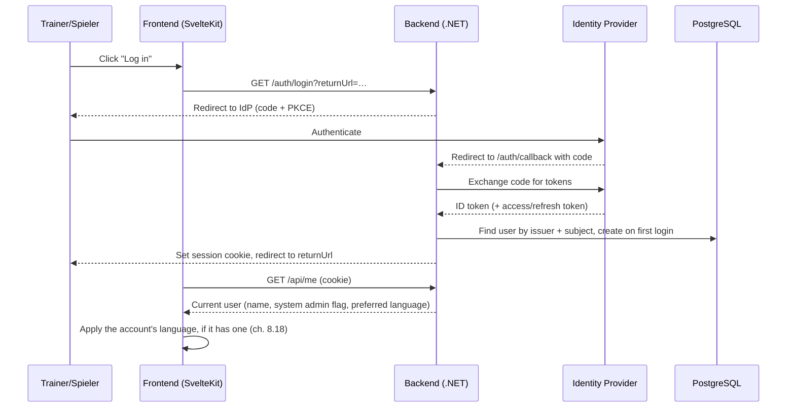
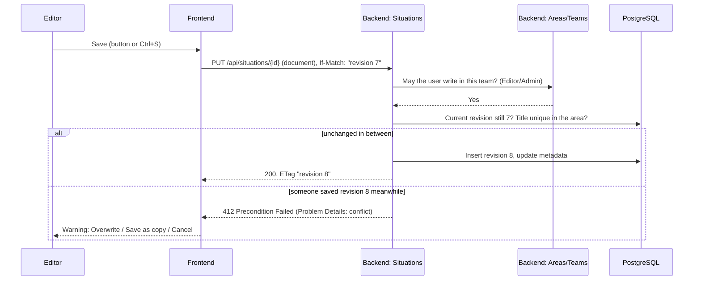

# 6. Runtime View

Representative scenarios, based on the modules from chapter 5.

## 6.1 Login (backend for frontend)

The backend is the OIDC client (Authorization Code flow with PKCE). Tokens stay in the backend; the browser only gets an `HttpOnly` session cookie (ch. 8.13).



A blocked user gets no session: the callback redirects to `/?login=blocked` ("Account blocked."); other failures to `/?login=failed`. A deleted account's identity gets a new, empty account. Every later request with the session cookie checks the user again (ch. 8.13).

**UI language** (ch. 8.18): before the first render the frontend starts in the remembered or the browser's language. Once `/api/me` reports a logged-in user, `AccountLanguage` applies the account's `preferredLanguage` (once per login). Choosing a language in the navbar applies it at once, remembers it in `localStorage`, and when logged in sends `PUT /api/me/language`, so the next login (in any browser) starts in it.

## 6.2 Save a team situation



"Overwrite" repeats the save with the newest revision as `If-Match`; "Save as copy" creates a new situation with the title suffix " (2)" (or the next free number), see ch. 8.15.

The personal area (implemented, roadmap Phase 2 step 3) works the same way without the role check: Areas answers "only the owner". The first save is `POST /api/personal-area/situations` (`201`, `ETag "1"`).

## 6.3 Open a saved situation, and reload the editor

```mermaid
sequenceDiagram
    participant U as User
    participant F as Frontend
    participant S as Backend: Situations
    participant A as Backend: Areas

    U->>F: Start page: click a saved situation
    F->>S: GET /api/situations/{id}
    S->>A: May the user read this area?
    A-->>S: Yes (personal area: the owner)
    S-->>F: 200, metadata + document, ETag "3"
    F-->>U: "Discard changes?" (only with unsaved changes)
    F->>F: Load into the editor, remember id + revision 3
    F-->>U: /editor?situation={id}
    Note over U,F: Reload of /editor?situation={id}: the in-memory situation is gone,<br/>so the editor route loads it again with the same GET (no question);<br/>if that fails (logged out, deleted, no server) it goes to the start page.
```


## 6.4 Move a situation into a folder, while the folder is being deleted

Implemented in roadmap Phase 2 step 4 (ch. 8.15). A folder may only be deleted while it is empty; a move into it (or a first save in it) must not slip in between the check and the deletion. Both run in one database transaction that locks the folder row (ADR-012).

```mermaid
sequenceDiagram
    participant U1 as User (tab 1)
    participant U2 as User (tab 2)
    participant S as Backend: Situations
    participant F as Backend: Folders
    participant DB as PostgreSQL

    U1->>S: PUT /api/situations/{id}/folder { folderId: F }
    S->>DB: BEGIN; folder F (not deleted) FOR SHARE
    U2->>F: DELETE /api/folders/F
    F->>DB: BEGIN; folder F (not deleted) FOR UPDATE
    Note over F,DB: waits for tab 1's transaction
    S->>DB: UPDATE situations SET folder_id = F; COMMIT
    S-->>U1: 200, metadata (revision and ETag unchanged)
    DB-->>F: lock granted
    F->>S: IFolderContents: does F contain situations?
    S-->>F: yes
    F->>DB: ROLLBACK
    F-->>U2: 409 folder-not-empty
```

The other order works the same way: a deletion that locked the folder first commits, and the waiting move then no longer finds the folder (`404 folder-not-found`). The frontend shows "“<name>” can't be deleted because it still contains situations. Move or delete them first." for `folder-not-empty`, and refuses at once (without asking the server) when the folder's page already lists situations.

## 6.5 Create a team with a logo, find it and open it by its link

Implemented in roadmap Phase 2 step 6 (ch. 8.17).

```mermaid
sequenceDiagram
    participant T as Trainer
    participant P as Spieler
    participant F as Frontend
    participant B as Backend: Teams
    participant DB as PostgreSQL

    T->>F: Start page: Create team (name, logo file)
    F->>F: Check type (PNG/JPEG/WebP) and size (≤ 5 MB), show preview
    F->>B: POST /api/teams (multipart: name, logo)
    B->>B: Validate name; detect format, check megapixels, turn upright,<br/>scale to fit 256 × 256, encode PNG (no metadata)
    B->>DB: Name free? Random code free (also among deleted teams)?
    B->>DB: INSERT team + Admin membership + logo (one SaveChanges)
    alt code taken in parallel (unique index)
        B->>B: New random code, try again (≤ 10 attempts)
    else name taken in parallel (unique index)
        B-->>F: 409 duplicate-team-name
    end
    B-->>F: 201, team { code, logoUrl: /api/teams/CODE/logo?v=hash, role: admin }
    F-->>T: Team page /teams/CODE
    P->>F: Teams overview: search "lions" or the code
    F->>B: GET /api/teams?search=lions&offset=0&limit=50
    B-->>F: { items, total }
    P->>F: Open /teams/CODE (link)
    F->>B: GET /api/teams/CODE
    B-->>F: team, role: null (no member)
    F->>B: GET /api/teams/CODE/logo?v=hash (If-None-Match on revalidation)
    B-->>F: 200 image/png + ETag, or 304
```
