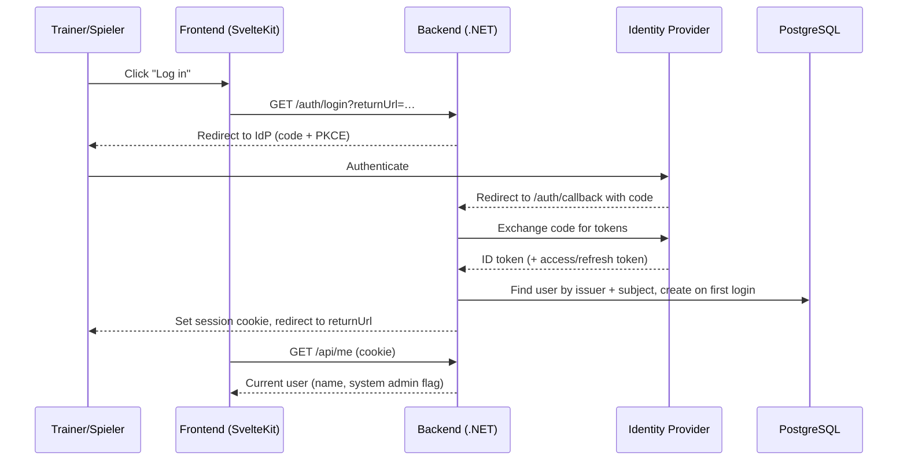
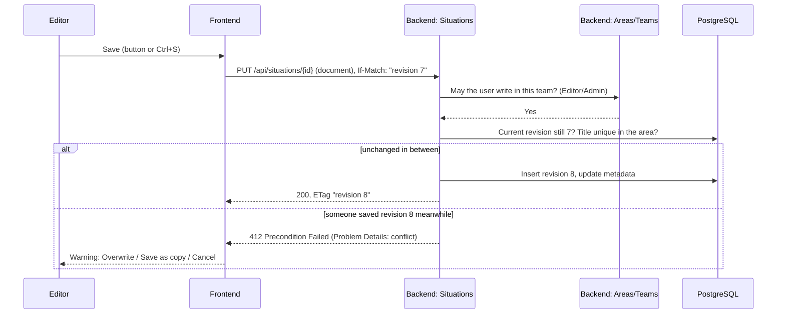

# 6. Runtime View

Representative scenarios, based on the modules from chapter 5.

## 6.1 Login (backend for frontend)

The backend is the OIDC client (Authorization Code flow with PKCE). Tokens stay in the backend; the browser only gets an `HttpOnly` session cookie (ch. 8.13).

A blocked or deleted user gets no session: the callback redirects to `/?login=failed` instead. Every later request with the session cookie checks the user again (ch. 8.13).

## 6.2 Save a team situation

"Overwrite" repeats the save with the newest revision as `If-Match`; "Save as copy" creates a new situation with the title suffix " (2)" (or the next free number), see ch. 8.15.
