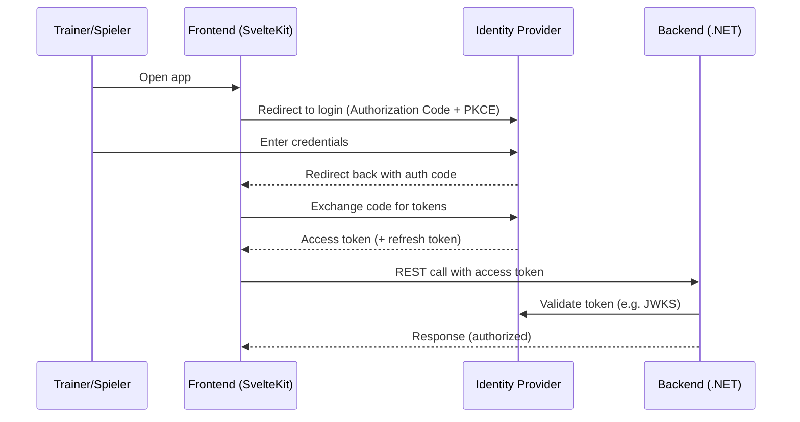
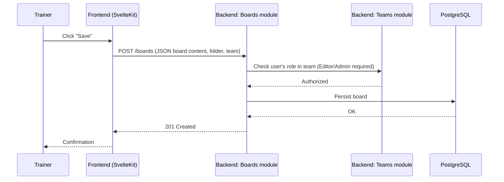

# 6. Runtime View

Two representative scenarios, based on the modules from chapter 5.

## 6.1 Login

_Assumes OAuth2 Authorization Code flow (with PKCE) against the self-hosted IdP — a common default for SPA + external IdP, not yet explicitly confirmed._

## 6.2 Save a board

