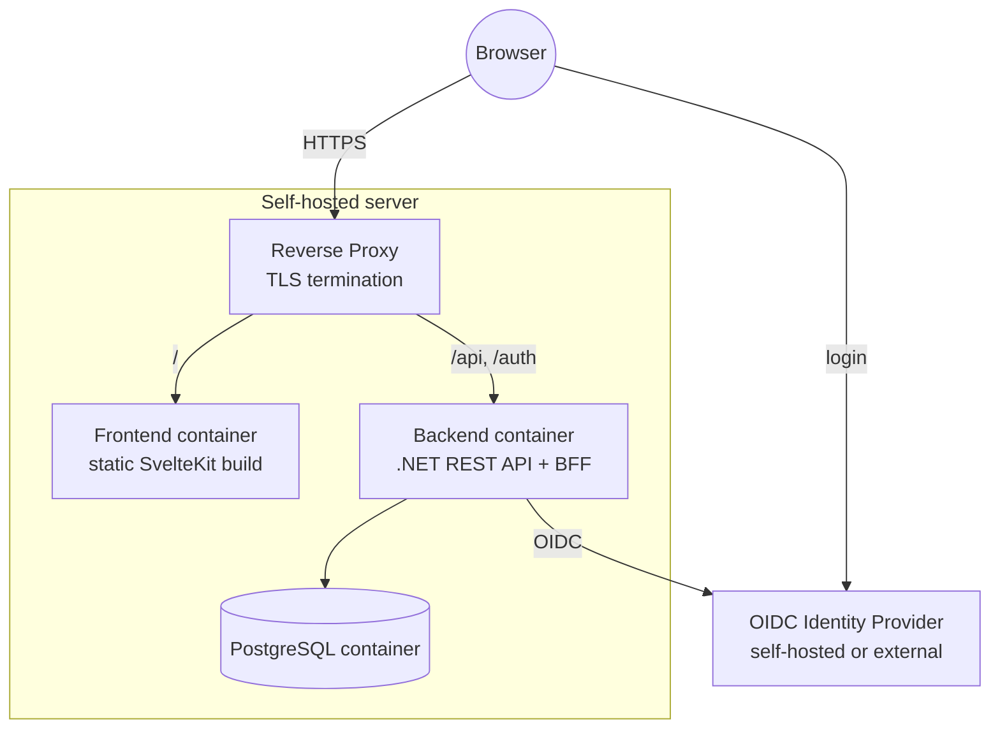

# 7. Deployment View

Single self-hosted deployment (per the constraints in ch. 2: containerized, self-hostable, reverse proxy assumed). Frontend and API are served under the **same origin** through the reverse proxy (`/` → frontend, `/api` and `/auth` → backend), so the session cookie works without CORS (ch. 8.13).

**Orchestration (ADR-005):**

- **Docker Compose** for local development and simple self-hosting. The local Compose setup also starts a development IdP and a reverse proxy, so the whole stack runs with one command.
- A **Helm chart** for Kubernetes follows later.

**Configuration** (environment variables): database connection, OIDC authority/client ID/client secret, the public base URL, the bootstrap system administrators (ch. 8.14), and a key store for the session/data-protection keys (a volume, so sessions survive a restart).

The database schema is created and updated by EF Core migrations when the backend starts.

### Implementation

**Containers:**

| Container | Image / build | Notes |
|---|---|---|
| Backend | `backend/Dockerfile` (.NET SDK build, `aspnet:10.0` runtime) | Port 8080, non-root. |
| Frontend | `frontend/Dockerfile` (static build, served by Caddy, `frontend/Caddyfile`) | Port 8080. Every path that is not a file gets `index.html` (SPA fallback); a missing `/_app/…` asset stays a 404. `/_app/immutable/*` is cached for a year, everything else is revalidated. |
| PostgreSQL | `postgres:18-alpine` | |

**Backend configuration** (environment variables; `__` separates sections):

| Variable | Required | Default | Meaning |
|---|---|---|---|
| `ConnectionStrings__TacticalBoard` | yes | – | Npgsql connection string. The backend does not start without it. |
| `Database__MigrateOnStartup` | no | `true` | Apply pending EF Core migrations before the backend accepts requests. A failed migration stops the start. Set to `false` to migrate separately. |
| `App__PublicBaseUrl` | no | – | Public URL of the app (absolute `http`/`https`, no query/fragment), e.g. `https://tacticalboard.example.org`. Validated at startup; the login (roadmap Phase 2 step 2) builds its callback URL from it. |
| `ASPNETCORE_HTTP_PORTS` | no | `8080` (container) | Standard ASP.NET Core setting. |

OIDC, bootstrap administrator and key-store settings are added with the login (roadmap Phase 2 step 2).

**Health:** `GET /api/health` returns `200` with `{"status":"Healthy","checks":{"database":"Healthy"}}`, or `503` with `Unhealthy` when the database can't be reached (no error details in the body).

**Local development (Docker Compose, `compose.yaml` at the repository root):**

| Service | Reached at | Purpose |
|---|---|---|
| `proxy` (Caddy, `deploy/proxy/Caddyfile`) | `http://localhost:8080` | One origin: `/api`, `/auth` → backend, everything else → frontend. No TLS locally. |
| `frontend`, `backend` | only through the proxy | Built from `frontend/` and `backend/`. |
| `db` (PostgreSQL) | `localhost:5432` | Data in the volume `db-data`. Published so the backend can also run outside Compose. |
| `idp` (Keycloak, dev mode) | `http://localhost:8180` | Development OIDC provider with the realm `tacticalboard` imported from `deploy/keycloak/tacticalboard-realm.json`. Issuer `http://localhost:8180/realms/tacticalboard` for browsers and containers alike; containers use `http://idp:8080` for the backchannel (`KC_HOSTNAME_BACKCHANNEL_DYNAMIC`). Not wired into the backend yet. |
