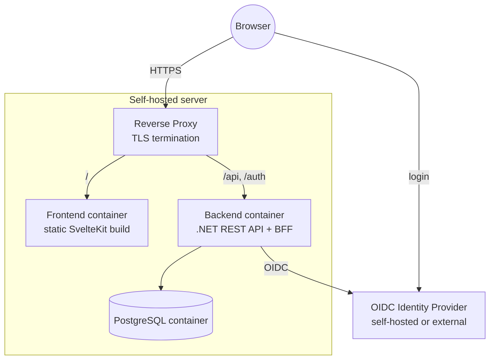
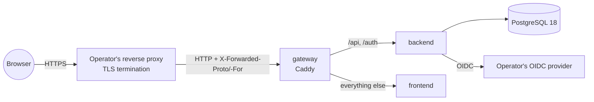

# 7. Deployment View

Single self-hosted deployment (per the constraints in ch. 2: containerized, self-hostable, reverse proxy assumed). Frontend and API are served under the **same origin** through the reverse proxy (`/` → frontend, `/api` and `/auth` → backend), so the session cookie works without CORS (ch. 8.13).

**Orchestration (ADR-005):**

- **Docker Compose** for local development and simple self-hosting. The local Compose setup also starts a development IdP and a reverse proxy, so the whole stack runs with one command (`compose.yaml` at the root, built from source). For self-hosting, `deploy/production/compose.yaml` runs the published images (ADR-016) without an IdP (below).
- A **Helm chart** for Kubernetes follows later.

**Configuration** (environment variables): database connection, OIDC authority/client ID/client secret, the public base URL, the bootstrap system administrators (ch. 8.14), and a key store for the session/data-protection keys (a volume, so sessions survive a restart). The complete reference for operators — every variable with required/default/example — is in [docs/deployment.md](../deployment.md#backend-configuration-reference); this chapter only summarizes it.

The database schema is created and updated by EF Core migrations when the backend starts. Saving situations (Phase 2 step 3) added the tables `situations` and `situation_revisions` (migration `AddSituations`) and made the users' identity index partial (`AllowNewAccountAfterDeletion`); it needs no new configuration. Teams (Phase 2 step 6) added the tables `teams`, `team_memberships` and `team_logos` (migration `AddTeams`); no new configuration either. Membership (Phase 2 step 7) added the table `team_join_requests` (migration `AddMembership`); no new configuration. The logo upload endpoints accept request bodies up to 5 MiB + 64 KiB; a reverse proxy in front must allow at least that (Caddy has no limit by default; nginx's default `client_max_body_size` of 1 MB would have to be raised). The backend image needs no extra system packages for the image library (ADR-014).

**Production topology** (the example in `deploy/production/`, operator guide [docs/deployment.md](../deployment.md)):

- The operator brings the TLS-terminating reverse proxy and the OIDC provider; the Compose example starts **no** identity provider.
- The **gateway** (Caddy, `deploy/production/Caddyfile`) gives the app its single origin (same routing as the local proxy) and is the only published port (default `127.0.0.1:8080`). It passes on `X-Forwarded-*` only from trusted addresses (`trusted_proxies`, default private ranges), so the scheme `https` seen by the operator's proxy reaches the backend.
- The backend runs with secure cookies and `ASPNETCORE_FORWARDEDHEADERS_ENABLED=true`; it trusts forwarded headers from any sender, so it is reachable only on the internal Compose network.
- Healthchecks: the backend's `/api/health` (via bash `/dev/tcp`, the runtime image has no HTTP client), `wget` for frontend and gateway, `pg_isready` for PostgreSQL. Every service has `restart: unless-stopped`.
- Volumes: `db-data` and `backend-keys`. One backend instance (startup migrations, file-system key ring).

**Build and release pipeline (ADR-016):** GitHub Actions in `.github/workflows/`:

| Workflow / job | Runs on | Does |
|---|---|---|
| `ci.yml` → `frontend` | every push and pull request | Node 24 + pnpm 11.25.0 (same versions as `frontend/Dockerfile`), `pnpm install --frozen-lockfile`, `check`, `test`, `build`; pnpm store cached by `actions/setup-node`. |
| `ci.yml` → `backend` | every push and pull request | .NET SDK from `backend/global.json`, `dotnet build --warnaserror` (Release), `dotnet test` (unit + Testcontainers integration tests on the runner's Docker); NuGet packages cached (key: `Directory.Packages.props`, project files, `global.json`). |
| `ci.yml` → `images` (calls `image.yml`) | pull requests and branch pushes, after both CI jobs | Test build of both images for `linux/amd64`, nothing pushed. |
| `ci.yml` → `publish` (calls `image.yml`) | pushes to `master` and tags `vX.Y.Z`, after both CI jobs | Builds both images for `linux/amd64` + `linux/arm64` and pushes them to `ghcr.io/svbrunner/tacticalboard-{backend,frontend}`. |

- **Tags** (docker/metadata-action): `master` → `latest` and `sha-<short sha>`; `vX.Y.Z` → `X.Y.Z` and `X.Y` (a pre-release `vX.Y.Z-suffix` → only `X.Y.Z-suffix`). A release is made by pushing a `vX.Y.Z` tag.
- **Labels and annotations**: OCI `source`, `revision`, `created`, `version`, `title`, `licenses=MIT` on the image and the multi-platform index (the Dockerfiles also carry `title`, `source` and `licenses`, so local builds are labelled too).
- **Cross-building**: the .NET SDK stage runs on the build platform (`--platform=$BUILDPLATFORM`) and cross-compiles with `--arch $TARGETARCH` (RID-specific publish; only the target's native SkiaSharp library is included); the Node stage also runs on the build platform, since its output is static. Only the backend runtime stage's small `RUN` steps (`apt-get`, `mkdir`) run under QEMU for arm64. Buildx layer cache in the GitHub Actions cache, one scope per image.
- **Permissions**: the workflow default is `contents: read`; only the publish job gets `packages: write`. The only credential is `GITHUB_TOKEN`. Actions are pinned to major version tags (ADR-016). Concurrent runs of one branch or pull request cancel each other, except on `master` and tags.
- Validate workflow changes locally with `actionlint` (in the Nix dev shell).

### Implementation

**Containers:**

| Container | Image / build | Notes |
|---|---|---|
| Backend | `backend/Dockerfile` (.NET SDK build, `aspnet:10.0` runtime); published as `ghcr.io/svbrunner/tacticalboard-backend` | Port 8080, non-root. `/var/lib/tacticalboard/keys` belongs to the app user (mount point for the key volume). `linux/amd64`, `linux/arm64`. |
| Frontend | `frontend/Dockerfile` (static build, served by Caddy, `frontend/Caddyfile`); published as `ghcr.io/svbrunner/tacticalboard-frontend` | Port 8080, `linux/amd64`, `linux/arm64`. Every path that is not a file gets `index.html` (SPA fallback); a missing `/_app/…` asset stays a 404. `/_app/immutable/*` is cached for a year, everything else is revalidated. |
| PostgreSQL | `postgres:18-alpine` | |

**Backend configuration** (environment variables; `__` separates sections). The full reference with defaults and examples is [docs/deployment.md](../deployment.md#backend-configuration-reference); in short:

- Required: `ConnectionStrings__TacticalBoard`, `Oidc__Authority`, `Oidc__ClientId`, and in every real deployment `App__PublicBaseUrl` (the OIDC redirect URIs `{url}/auth/callback` and `{url}/auth/signout-callback` are built from it) and `DataProtection__KeysDirectory` (a volume).
- OIDC options: `Oidc__ClientSecret` (confidential client, recommended), `Oidc__Scope` (default `openid profile email`), `Oidc__MetadataAddress` (discovery from another address), `Oidc__RequireHttpsMetadata` (default `true`; `false` only for a local http IdP).
- Behind a TLS-terminating proxy: `Session__SecureCookies=true` (the default) together with `ASPNETCORE_FORWARDEDHEADERS_ENABLED=true` (trusts `X-Forwarded-Proto`/`-For` from any sender, so the backend must be reachable only through the proxy).
- `Database__MigrateOnStartup` (default `true`), `Bootstrap__SystemAdministrators` (`issuer|subject` entries, ch. 8.14), standard ASP.NET Core settings (`Logging__LogLevel__*`, `ASPNETCORE_HTTP_PORTS`, `AllowedHosts`).

**Volumes:** `db-data` (PostgreSQL) and `backend-keys` (the backend's data-protection keys at `/var/lib/tacticalboard/keys`).

**Health:** `GET /api/health` returns `200` with `{"status":"Healthy","checks":{"database":"Healthy"}}`, or `503` with `Unhealthy` when the database can't be reached (no error details in the body).

**Local development (Docker Compose, `compose.yaml` at the repository root):**

| Service | Reached at | Purpose |
|---|---|---|
| `proxy` (Caddy, `deploy/proxy/Caddyfile`) | `http://localhost:8080` | One origin: `/api`, `/auth` → backend, everything else → frontend. No TLS locally. |
| `frontend`, `backend` | only through the proxy | Built from `frontend/` and `backend/`. |
| `db` (PostgreSQL) | `localhost:5432` | Data in the volume `db-data`. Published so the backend can also run outside Compose. |
| `idp` (Keycloak, dev mode) | `http://localhost:8180` | Development OIDC provider with the realm `tacticalboard` imported from `deploy/keycloak/tacticalboard-realm.json` (client `tacticalboard`, users `trainer` and `player` with fixed subjects; redirect URIs for the proxy `:8080`, the backend `:5080` and the Vite dev server `:5173`). Issuer `http://localhost:8180/realms/tacticalboard` for browsers and containers alike; containers use `http://idp:8080` for the backchannel (`KC_HOSTNAME_BACKCHANNEL_DYNAMIC`). The backend reads discovery from `http://idp:8080/...` (`Oidc__MetadataAddress`) over http (`Oidc__RequireHttpsMetadata=false`). `trainer` is configured as bootstrap system administrator. |

**Local development without Compose for the backend:** `appsettings.Development.json` points at the Compose database and IdP (`docker compose up -d db idp`), uses http cookies and `App__PublicBaseUrl=http://localhost:5173`, so the login runs through the Vite dev server, which proxies `/api` and `/auth` to the backend on `:5080` (`frontend/vite.config.ts`; another backend address via `TACTICALBOARD_BACKEND`).
