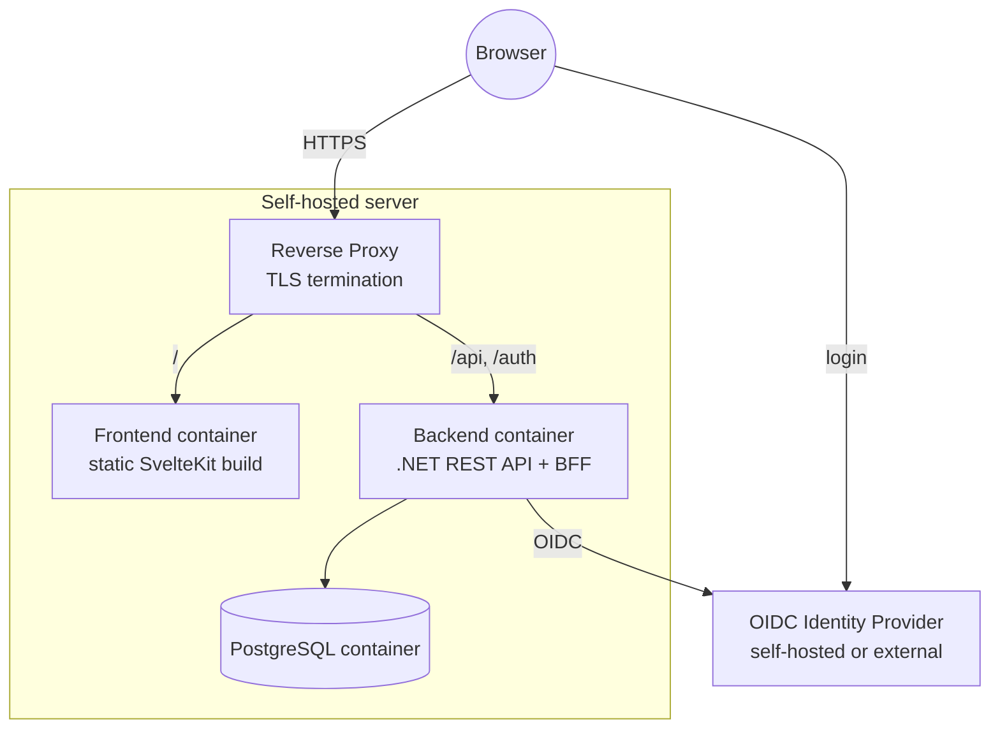

# 7. Deployment View

Single self-hosted deployment (per the constraints in ch. 2: containerized, self-hostable, reverse proxy assumed). Frontend and API are served under the **same origin** through the reverse proxy (`/` → frontend, `/api` and `/auth` → backend), so the session cookie works without CORS (ch. 8.13).

**Orchestration (ADR-005):**

- **Docker Compose** for local development and simple self-hosting. The local Compose setup also starts a development IdP and a reverse proxy, so the whole stack runs with one command.
- A **Helm chart** for Kubernetes follows later.

**Configuration** (environment variables): database connection, OIDC authority/client ID/client secret, the public base URL, the bootstrap system administrators (ch. 8.14), and a key store for the session/data-protection keys (a volume, so sessions survive a restart). The full list is below.

The database schema is created and updated by EF Core migrations when the backend starts. Saving situations (Phase 2 step 3) added the tables `situations` and `situation_revisions` (migration `AddSituations`) and made the users' identity index partial (`AllowNewAccountAfterDeletion`); it needs no new configuration.

### Implementation

**Containers:**

| Container | Image / build | Notes |
|---|---|---|
| Backend | `backend/Dockerfile` (.NET SDK build, `aspnet:10.0` runtime) | Port 8080, non-root. `/var/lib/tacticalboard/keys` belongs to the app user (mount point for the key volume). |
| Frontend | `frontend/Dockerfile` (static build, served by Caddy, `frontend/Caddyfile`) | Port 8080. Every path that is not a file gets `index.html` (SPA fallback); a missing `/_app/…` asset stays a 404. `/_app/immutable/*` is cached for a year, everything else is revalidated. |
| PostgreSQL | `postgres:18-alpine` | |

**Backend configuration** (environment variables; `__` separates sections):

| Variable | Required | Default | Meaning |
|---|---|---|---|
| `ConnectionStrings__TacticalBoard` | yes | – | Npgsql connection string. The backend does not start without it. |
| `Database__MigrateOnStartup` | no | `true` | Apply pending EF Core migrations before the backend accepts requests. A failed migration stops the start. Set to `false` to migrate separately. |
| `App__PublicBaseUrl` | no | – | Public URL of the app (absolute `http`/`https`, no query/fragment), e.g. `https://tacticalboard.example.org`. Validated at startup. The login builds the redirect URIs it sends to the IdP from it (`{url}/auth/callback`, `{url}/auth/signout-callback`); without it they are derived from the request. Set it in every deployment. |
| `Oidc__Authority` | yes | – | The IdP's issuer URL, e.g. `https://id.example.org/realms/tacticalboard`. Any standard OpenID Connect provider. The backend does not start without it. |
| `Oidc__ClientId` | yes | – | Client ID registered at the IdP. Register the redirect URI `{App__PublicBaseUrl}/auth/callback` and the post-logout redirect URI `{App__PublicBaseUrl}/auth/signout-callback`; the client uses the Authorization Code flow with PKCE (S256). |
| `Oidc__ClientSecret` | no | – | Client secret of a confidential client (recommended). Empty for a public client (PKCE only). |
| `Oidc__MetadataAddress` | no | `{Authority}/.well-known/openid-configuration` | Where the backend reads the discovery document, if it has to use another address than browsers (e.g. a container-internal host name). |
| `Oidc__RequireHttpsMetadata` | no | `true` | Discovery over HTTPS only. Set to `false` only for a local development IdP over http. |
| `Oidc__Scope` | no | `openid profile email` | Requested scopes, space-separated; must contain `openid`. `profile`/`email` provide the initial display name. |
| `Session__SecureCookies` | no | `true` | Session and antiforgery cookies are `Secure` and use the `__Host-` prefix. Set to `false` only for local development over plain http. With `true`, the backend must see HTTPS requests: behind a TLS-terminating proxy also set `ASPNETCORE_FORWARDEDHEADERS_ENABLED`. |
| `ASPNETCORE_FORWARDEDHEADERS_ENABLED` | behind a TLS proxy | `false` | Standard ASP.NET Core switch: trust `X-Forwarded-Proto`/`-For` from the reverse proxy, so a request that arrived over HTTPS counts as HTTPS. It trusts any sender, so the backend port must be reachable only through the proxy. |
| `DataProtection__KeysDirectory` | recommended | – | Directory (a volume) for the data-protection keys that protect the session and antiforgery cookies. Without it the keys live in the container and every recreation logs everyone out. |
| `Bootstrap__SystemAdministrators` | no | – | Identities that become system administrators (ch. 8.14): entries `issuer|subject`, separated by `;` (or as a list `Bootstrap__SystemAdministrators__0`, `__1`, …). The issuer must match the IdP's `iss` exactly. |
| `ASPNETCORE_HTTP_PORTS` | no | `8080` (container) | Standard ASP.NET Core setting. |

**Volumes:** `db-data` (PostgreSQL) and `backend-keys` (the backend's data-protection keys at `/var/lib/tacticalboard/keys`).

**Health:** `GET /api/health` returns `200` with `{"status":"Healthy","checks":{"database":"Healthy"}}`, or `503` with `Unhealthy` when the database can't be reached (no error details in the body).

**Local development (Docker Compose, `compose.yaml` at the repository root):**

| Service | Reached at | Purpose |
|---|---|---|
| `proxy` (Caddy, `deploy/proxy/Caddyfile`) | `http://localhost:8080` | One origin: `/api`, `/auth` → backend, everything else → frontend. No TLS locally. |
| `frontend`, `backend` | only through the proxy | Built from `frontend/` and `backend/`. |
| `db` (PostgreSQL) | `localhost:5432` | Data in the volume `db-data`. Published so the backend can also run outside Compose. |
| `idp` (Keycloak, dev mode) | `http://localhost:8180` | Development OIDC provider with the realm `tacticalboard` imported from `deploy/keycloak/tacticalboard-realm.json` (client `tacticalboard`, users `trainer` and `player` with fixed subjects; redirect URIs for the proxy `:8080`, the backend `:5080` and the Vite dev server `:5173`). Issuer `http://localhost:8180/realms/tacticalboard` for browsers and containers alike; containers use `http://idp:8080` for the backchannel (`KC_HOSTNAME_BACKCHANNEL_DYNAMIC`). The backend reads discovery from `http://idp:8080/...` (`Oidc__MetadataAddress`) over http (`Oidc__RequireHttpsMetadata=false`). `trainer` is configured as bootstrap system administrator. |

**Local development without Compose for the backend:** `appsettings.Development.json` points at the Compose database and IdP (`docker compose up -d db idp`), uses http cookies and `App__PublicBaseUrl=http://localhost:5173`, so the login runs through the Vite dev server, which proxies `/api` and `/auth` to the backend on `:5080` (`frontend/vite.config.ts`; another backend address via `TACTICALBOARD_BACKEND`).
