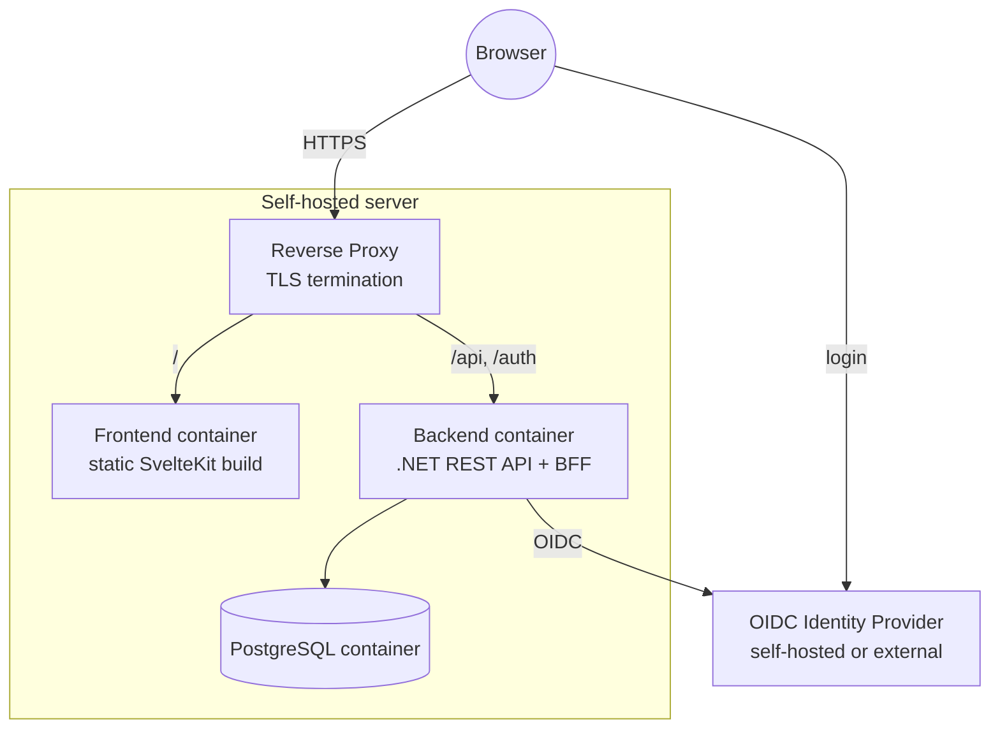

# 7. Deployment View

Single self-hosted deployment (per the constraints in ch. 2: containerized, self-hostable, reverse proxy assumed). Frontend and API are served under the **same origin** through the reverse proxy (`/` → frontend, `/api` and `/auth` → backend), so the session cookie works without CORS (ch. 8.13).

**Orchestration (ADR-005):**

- **Docker Compose** for local development and simple self-hosting. The local Compose setup also starts a development IdP and a reverse proxy, so the whole stack runs with one command.
- A **Helm chart** for Kubernetes follows later.

**Configuration** (environment variables): database connection, OIDC authority/client ID/client secret, the public base URL, the bootstrap system administrators (ch. 8.14), and a key store for the session/data-protection keys (a volume, so sessions survive a restart).

The database schema is created and updated by EF Core migrations when the backend starts.
