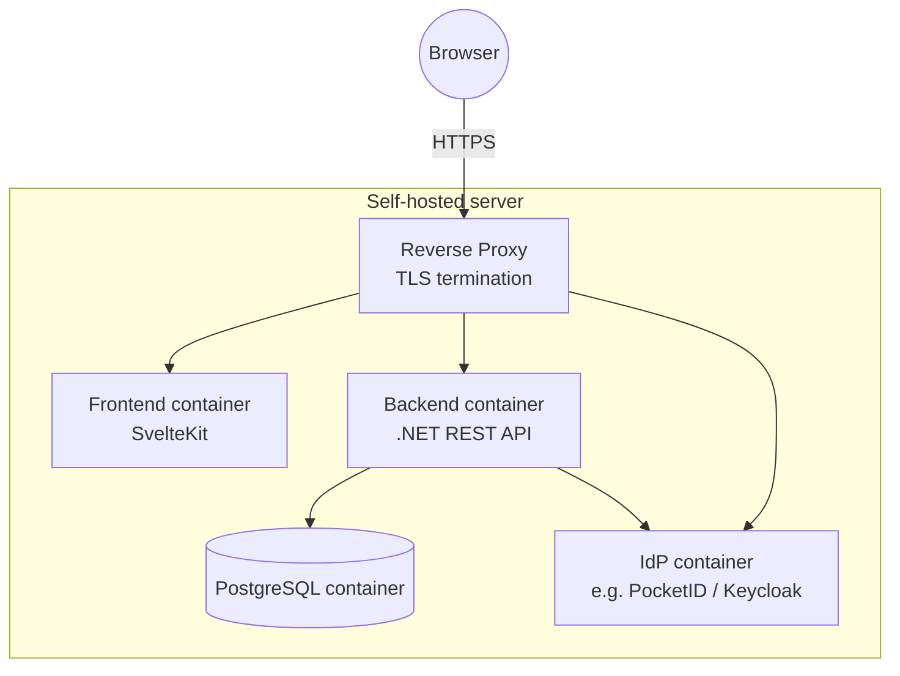

# 7. Deployment View

Single self-hosted deployment (per the constraints in ch. 2: containerized, self-hostable, reverse proxy assumed).

_TBD: container orchestration (plain Docker Compose vs. Kubernetes vs. something else) — not yet decided. Docker Compose is the likely default for a self-hosted, solo-maintained deployment, but not confirmed._
