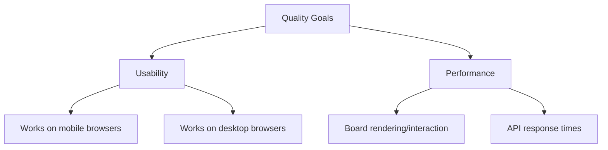

# 10. Quality Requirements

## 10.1 Quality Tree

## 10.2 Quality Scenarios

| ID | Quality | Scenario | Expected response |
|---|---|---|---|
| U-1 | Usability (touch) | A trainer holds a phone (portrait or landscape) or a tablet and, using only a finger, places a player, moves it, changes its type and color, and deletes it. | All of it works by touch alone, without a keyboard, mouse, or right-click. Every interactive target (buttons, swatches, elements on the field) is at least 44 × 44 CSS px; the field is fully visible without scrolling; the page neither scrolls nor zooms while working on the field. |

_Further scenarios (performance target numbers, load assumptions) are still to be defined once there's something to measure against._
