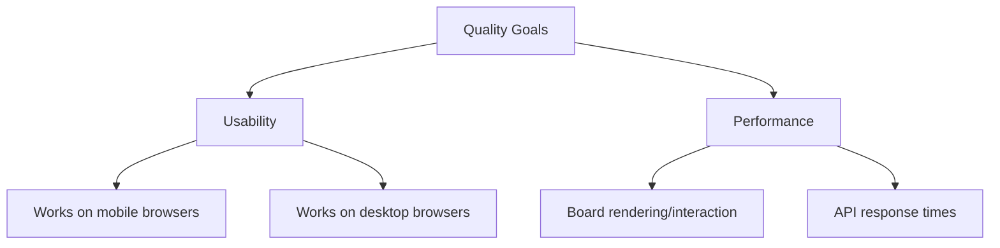

# 10. Quality Requirements

## 10.1 Quality Tree

## 10.2 Quality Scenarios

_TBD — no concrete, measurable scenarios (target numbers, load assumptions) defined yet. Add these once there's something to measure against._
