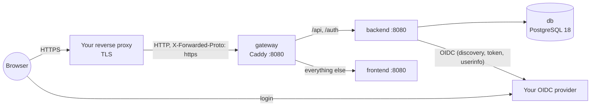

# Deploying TacticalBoard

This guide is for operators who run TacticalBoard on their own server. It lists everything that must be set. The architecture behind it is in [arc42 ch. 7](arc42/07_deployment_view.md); login and session in [ch. 8.13](arc42/08_crosscutting_concepts.md).

**Checklist** — a deployment needs:

1. A host with Docker (Compose v2) — or any container runtime that runs OCI images — on `linux/amd64` or `linux/arm64`.
2. A **domain with TLS** and a **reverse proxy** in front of the app ([Reverse proxy](#reverse-proxy)).
3. An **OpenID Connect provider** with a client registered for TacticalBoard ([OIDC provider](#openid-connect-provider)). TacticalBoard has no user accounts of its own and ships no identity provider for production.
4. A **PostgreSQL** database (the example starts one) and a **volume** for the backend's data-protection keys.
5. The **configuration** below, at least: public URL, OIDC authority, client ID (and secret), database password — and the identity of the first system administrator.

## Contents

- [Images and releases](#images-and-releases)
- [Quick start with Docker Compose](#quick-start-with-docker-compose)
- [Backend configuration reference](#backend-configuration-reference)
- [OpenID Connect provider](#openid-connect-provider)
- [Reverse proxy](#reverse-proxy)
- [The first system administrator](#the-first-system-administrator)
- [Database](#database)
- [Data-protection keys](#data-protection-keys)
- [Health, logs and monitoring](#health-logs-and-monitoring)
- [Upgrading](#upgrading)

## Images and releases

Two images are published to the GitHub Container Registry for `linux/amd64` and `linux/arm64`:

| Image | Contents | Port |
|---|---|---|
| `ghcr.io/svbrunner/tacticalboard-backend` | ASP.NET Core backend (REST API + login), runs as a non-root user | 8080 |
| `ghcr.io/svbrunner/tacticalboard-frontend` | The static web app, served by Caddy | 8080 |

**Tags:**

| Tag | Points to | Use |
|---|---|---|
| `X.Y.Z` (e.g. `1.2.3`) | Exactly that release | Production — recommended. |
| `X.Y` (e.g. `1.2`) | The newest patch release of `X.Y` | Production, if you want patch releases automatically. |
| `latest` | The newest build of the `master` branch | Trying things out. Not a release; can change any time. |
| `sha-<commit>` (e.g. `sha-dedd9db`) | The build of one `master` commit | Pinning an unreleased build. |

Always run the backend and the frontend with the **same tag**.

**How a release is made** (maintainers): every push to `master` and every pull request runs CI (frontend check/tests/build, backend build and unit + integration tests, a test build of both images). After CI has passed on `master`, the images are pushed as `latest` and `sha-<commit>`. A release is created by pushing a version tag:

```bash
git tag -a v1.2.3 -m "TacticalBoard 1.2.3"
git push origin v1.2.3
```

The tag must look like `vX.Y.Z`. After CI passes, the images are pushed as `1.2.3` and `1.2`. A pre-release tag such as `v1.3.0-rc.1` gets only `1.3.0-rc.1` (no `X.Y` tag). The workflows are in `.github/workflows/` (`ci.yml`, `image.yml`); the reasoning is ADR-016 ([ch. 9](arc42/09_architecture_decisions.md)).

## Quick start with Docker Compose

An example deployment is in [`deploy/production/`](../deploy/production/):

| File | Purpose |
|---|---|
| `compose.yaml` | Gateway (Caddy), frontend, backend, PostgreSQL 18; volumes, healthchecks, `restart: unless-stopped` |
| `Caddyfile` | The gateway: `/api`, `/auth` → backend, everything else → frontend, one origin |
| `.env.example` | Every variable of the example, with explanations |

```bash
# on the server, in a copy of deploy/production/
cp .env.example .env
$EDITOR .env                 # fill in every REQUIRED value (see below)
docker compose up -d
docker compose ps            # all services should become "healthy"
curl http://127.0.0.1:8080/api/health
```

Then point your TLS-terminating reverse proxy at `127.0.0.1:8080` ([Reverse proxy](#reverse-proxy)) and open your public URL.



Only the gateway is published (by default on `127.0.0.1` only). The backend, frontend and database are reachable only on the Compose network.

**The example's variables** (`.env`; Compose refuses to start when a required one is missing):

| Variable | Required | Default | Sets |
|---|---|---|---|
| `PUBLIC_BASE_URL` | **yes** | – | `App__PublicBaseUrl` |
| `OIDC_AUTHORITY` | **yes** | – | `Oidc__Authority` |
| `OIDC_CLIENT_ID` | **yes** | – | `Oidc__ClientId` |
| `OIDC_CLIENT_SECRET` | for a confidential client (recommended) | empty | `Oidc__ClientSecret` |
| `OIDC_SCOPE` | no | `openid profile email` | `Oidc__Scope` |
| `BOOTSTRAP_SYSTEM_ADMINISTRATORS` | no, but needed for the first admin | empty | `Bootstrap__SystemAdministrators` |
| `POSTGRES_PASSWORD` | **yes** | – | The database user's password and the backend's connection string. Letters and digits only (it is put into a connection string), e.g. `openssl rand -hex 32`. Set it **before the first start**: PostgreSQL takes it only when it creates the database. |
| `TACTICALBOARD_VERSION` | no | `latest` | Image tag of both images. Pin a release. |
| `TACTICALBOARD_HTTP_BIND` | no | `127.0.0.1` | Host address the gateway is published on. |
| `TACTICALBOARD_HTTP_PORT` | no | `8080` | Host port the gateway is published on. |
| `GATEWAY_TRUSTED_PROXIES` | no | `private_ranges` | Source addresses (CIDR, space-separated) whose `X-Forwarded-*` headers the gateway passes on — your reverse proxy. `private_ranges` covers loopback and private networks (a proxy on the same host reaches the gateway from the Docker bridge network). |
| `BACKEND_LOG_LEVEL` | no | `Information` | `Logging__LogLevel__Default` |

The example fixes the remaining backend settings to production values: secure cookies, forwarded headers on, migrations at startup, keys in the `backend-keys` volume. To set another backend variable from the [reference](#backend-configuration-reference), add it under `services.backend.environment` (or in a `compose.override.yaml` next to it).

Not using Compose? Run the two images with the [backend variables](#backend-configuration-reference), a PostgreSQL database, a persistent directory for the keys, and a router in front that sends `/api` and `/auth` to the backend and everything else to the frontend under **one origin** (the example's `Caddyfile` shows the rules). A Helm chart is planned ([roadmap](roadmap.md)).

## Backend configuration reference

The backend is configured only through environment variables (ASP.NET Core configuration; `__` separates sections, e.g. `Oidc__ClientId` is `Oidc:ClientId`). Invalid values stop the start with a message in the log ("fail fast"). This is the complete list of the backend's own settings plus the standard ASP.NET Core settings that matter for a deployment.

| Variable | Required | Default | Example | Meaning |
|---|---|---|---|---|
| `ConnectionStrings__TacticalBoard` | **yes** | – | `Host=db;Port=5432;Database=tacticalboard;Username=tacticalboard;Password=…` | Npgsql connection string of the PostgreSQL database. The user must be allowed to create and change tables (migrations). Add e.g. `SSL Mode=Require` for a remote database. |
| `Database__MigrateOnStartup` | no | `true` | `false` | Apply pending database migrations before the backend accepts requests. A failed migration stops the start. With `false` you have to migrate separately. |
| `App__PublicBaseUrl` | **yes** in production | – | `https://tacticalboard.example.org` | The URL users open: absolute `https` (or `http` locally), no query or fragment, no trailing path. The OIDC redirect URIs are built from it (`…/auth/callback`, `…/auth/signout-callback`). Without it they would be derived from each request, which behind proxies is fragile — always set it. |
| `Oidc__Authority` | **yes** | – | `https://id.example.org/realms/tacticalboard` | The provider's issuer URL. The backend reads `{Authority}/.well-known/openid-configuration`. |
| `Oidc__ClientId` | **yes** | – | `tacticalboard` | The client ID registered at the provider. |
| `Oidc__ClientSecret` | for a confidential client | – | (a long random string) | The client secret. Recommended (confidential client). Leave empty only for a public client (PKCE only). |
| `Oidc__Scope` | no | `openid profile email` | `openid profile email` | Requested scopes, space-separated; must contain `openid`. `profile` and `email` provide the initial display name. |
| `Oidc__MetadataAddress` | no | `{Authority}/.well-known/openid-configuration` | `http://idp:8080/realms/x/.well-known/openid-configuration` | Read the discovery document from another address than the issuer, e.g. a container-internal host name. The issuer inside it must still equal `Oidc__Authority`. |
| `Oidc__RequireHttpsMetadata` | no | `true` | `false` | Discovery only over HTTPS. Set `false` **only** for a local development provider over plain http. |
| `Session__SecureCookies` | no | `true` | `true` | Session and antiforgery cookies are `Secure` and named with the `__Host-` prefix. Keep `true` in production; `false` only for local development over plain http. With `true` the backend must see the requests as HTTPS (`ASPNETCORE_FORWARDEDHEADERS_ENABLED`). |
| `ASPNETCORE_FORWARDEDHEADERS_ENABLED` | **yes** behind a TLS proxy | `false` | `true` | Standard ASP.NET Core switch: take the scheme and client address from `X-Forwarded-Proto` / `X-Forwarded-For`. Required behind a TLS-terminating proxy — otherwise requests count as plain http and every state-changing request fails. It trusts **any** sender of these headers (no known-proxy list), so the backend's port must be reachable only through your proxy/gateway, never directly. |
| `DataProtection__KeysDirectory` | **yes** in production | – | `/var/lib/tacticalboard/keys` | Directory (a persistent volume) for the [data-protection keys](#data-protection-keys). In the image, `/var/lib/tacticalboard/keys` belongs to the app user. |
| `Bootstrap__SystemAdministrators` | for the first admin | – | `https://id.example.org/realms/tacticalboard\|8f6d5f3e-…` | Identities that become system administrators: `issuer\|subject`, several separated by `;` (or as a list `Bootstrap__SystemAdministrators__0`, `__1`, …). A malformed entry stops the start. See [The first system administrator](#the-first-system-administrator). |
| `Logging__LogLevel__Default` | no | `Information` | `Warning` | Minimum log level. Per category e.g. `Logging__LogLevel__Microsoft.AspNetCore` (default `Warning`). |
| `ASPNETCORE_HTTP_PORTS` | no | `8080` | `8080` | Port the backend listens on inside the container (plain HTTP). |
| `AllowedHosts` | no | `*` | `tacticalboard.example.org` | Standard ASP.NET Core host filtering; restrict to your host name(s) (`;`-separated) if you like. The gateway passes the original `Host` header. |
| `ASPNETCORE_ENVIRONMENT` | no | `Production` | – | Leave unset. `Development` would load development settings (local database, local IdP, insecure cookies). |

The frontend image needs no configuration: it calls the backend under the same origin.

## OpenID Connect provider

Any standard OpenID Connect provider works (e.g. Keycloak, Authentik, PocketID, Zitadel; ADR-003). Who may log in is decided in the provider: every successful login creates a TacticalBoard user on first use. Register **one client** for TacticalBoard:

| Setting | Value |
|---|---|
| Client type | **Confidential** (with a client secret) — recommended. A public client (no secret, PKCE only) works too. |
| Flow / grant | **Authorization Code** only (no implicit, no password grant). |
| PKCE | **S256** — always used by the backend; enable "require PKCE" if the provider offers it. |
| Redirect URI | `<PUBLIC_BASE_URL>/auth/callback`, e.g. `https://tacticalboard.example.org/auth/callback` |
| Post-logout redirect URI | `<PUBLIC_BASE_URL>/auth/signout-callback` |
| Scopes | `openid profile email` (or what `Oidc__Scope` says; `openid` is mandatory) |
| Client authentication | Client secret sent in the token request body (`client_secret_post`, ASP.NET Core's default). |
| Front-channel / back-channel logout | Not used — leave empty. |
| Web origins / CORS | Not needed (the browser never calls the provider's APIs). |

**Claims the backend reads** (from the ID token and the userinfo endpoint):

- `iss` and `sub` — **required**; together they identify the user (never the e-mail). Keep subjects stable: a user whose `sub` changes gets a new, empty account.
- `name`, then `preferred_username`, then `email` — the initial display name on the first login (fallback "User"). Optional; users can change their display name in the app.

**Endpoints the backend calls** (server to server, so the backend container needs outgoing access to the provider): discovery, JWKS, token, userinfo, and — if the provider advertises one — the pushed authorization request endpoint (PAR, used automatically when available) and the `end_session_endpoint` for logout (without it, logout ends only the TacticalBoard session).

**Issuer** — `Oidc__Authority` must equal the `issuer` in the provider's discovery document, character for character (watch trailing slashes):

```bash
curl -s https://id.example.org/realms/tacticalboard/.well-known/openid-configuration | jq -r .issuer
```

## Reverse proxy

TacticalBoard expects a reverse proxy that you run (nginx, Caddy, Traefik, …) in front of the gateway. Requirements:

1. **TLS**: terminate HTTPS for your domain and forward plain HTTP to the gateway (`127.0.0.1:8080` in the example). Redirect http → https.
2. **`X-Forwarded-Proto: https`** (and `X-Forwarded-For`) must reach the backend. Without it the backend sees plain http and logins and every save fail (the secure cookies and the antiforgery check need HTTPS). The example gateway passes these headers on only when they come from a trusted address (`GATEWAY_TRUSTED_PROXIES`); the backend trusts them because of `ASPNETCORE_FORWARDEDHEADERS_ENABLED=true`.
3. **Request body size ≥ 6 MB**: team logos can be up to 5 MiB (the backend accepts request bodies up to 5 MiB + 64 KiB). nginx's default `client_max_body_size` of 1 MB is too small; Caddy and Traefik have no limit by default. 10 MB is a comfortable value.
4. **One origin**: the whole app — frontend, `/api` and `/auth` — must be served under the same scheme, host and port (`PUBLIC_BASE_URL`). Don't put the app under a sub-path (`https://example.org/tacticalboard/` is not supported) and don't split the API onto another host.
5. **Don't expose the backend directly**: only the gateway (or your proxy) may reach the backend's port, because the backend trusts forwarded headers from any sender.

**nginx:**

```nginx
server {
    listen 443 ssl;
    http2 on;
    server_name tacticalboard.example.org;
    # ssl_certificate / ssl_certificate_key …

    client_max_body_size 10m;

    location / {
        proxy_pass http://127.0.0.1:8080;
        proxy_set_header Host $host;
        proxy_set_header X-Forwarded-Proto $scheme;
        proxy_set_header X-Forwarded-For $proxy_add_x_forwarded_for;
    }
}
```

**Caddy** (sets the forwarded headers and handles certificates itself):

```caddy
tacticalboard.example.org {
	reverse_proxy 127.0.0.1:8080
}
```

If your proxy runs on another machine, publish the gateway on a private interface (`TACTICALBOARD_HTTP_BIND`) and set `GATEWAY_TRUSTED_PROXIES` to the proxy's address.

## The first system administrator

System administrators manage users and teams. The first one comes from the configuration (`Bootstrap__SystemAdministrators`, arc42 ch. 8.14): a listed identity gets the role when it logs in and no active system administrator exists (or on its very first login). After that, roles are managed in the app; removing an entry from the configuration does not revoke anything.

An entry is `issuer|subject`:

- **issuer** — the provider's `issuer`, exactly as in its discovery document (see above), e.g. `https://id.example.org/realms/tacticalboard`.
- **subject** — the user's `sub` claim at that provider. Where to find it: in Keycloak the user's **ID** in the admin console; in other providers the user's ID or "subject" in its admin UI (it depends on the provider's subject setting, so check it).

If you can't find the subject in the provider, let the person log in once and read it from the database:

```bash
docker compose exec db psql -U tacticalboard -d tacticalboard \
  -c "SELECT issuer, subject, display_name, created_at FROM users WHERE deleted_at IS NULL ORDER BY created_at;"
```

Then set `BOOTSTRAP_SYSTEM_ADMINISTRATORS=<issuer>|<subject>` (several separated by `;`), run `docker compose up -d` to apply it, and let the person **log out and log in again** — since no system administrator exists yet, they get the role.

The same entry is also the recovery path: if every system administrator is gone (blocked or deleted), a configured identity gets the role again on its next login.

## Database

- **PostgreSQL 18** (the example uses `postgres:18-alpine`; the tests run against the same version). An external PostgreSQL works too: drop the `db` service and set `ConnectionStrings__TacticalBoard` yourself.
- **Schema**: created and updated automatically at startup by EF Core migrations (`Database__MigrateOnStartup=true`). The database user must own the database (create/alter tables). A failed migration stops the backend; the log says why.
- **Run one backend instance.** Several instances against one database would race on the startup migrations (and would also need a shared key directory); scaling out is not supported yet.
- **Data**: in the `db-data` volume. Deleted items are only marked as deleted (soft delete) and stay in the database.

**Backups** — back up regularly, and always before an upgrade:

```bash
# backup (custom format, compressed)
docker compose exec -T db pg_dump -U tacticalboard -d tacticalboard -Fc > tacticalboard-$(date +%F).dump

# restore into an empty database (stop the backend first)
docker compose stop backend
docker compose exec -T db dropdb -U tacticalboard --force tacticalboard
docker compose exec -T db createdb -U tacticalboard tacticalboard
docker compose exec -T db pg_restore -U tacticalboard -d tacticalboard --no-owner < tacticalboard-2026-10-05.dump
docker compose start backend
```

## Data-protection keys

ASP.NET Core encrypts the session cookie (and the antiforgery tokens and the short-lived login cookies) with **data-protection keys**. The backend persists them to `DataProtection__KeysDirectory`, in the example the `backend-keys` volume.

- **Why it matters:** without a persistent directory the keys live inside the container. Every recreation of the container (an upgrade, `docker compose up` after a config change) then creates new keys, which **logs every user out** and makes logins that are in progress fail. No data is lost — users just log in again.
- The keys are stored **unencrypted** on the volume; whoever can read them can forge sessions. Protect the volume like the database.
- Keys rotate automatically (every 90 days); old keys stay to read existing cookies. Don't delete the directory's contents unless you want to end all sessions.
- Backing up the volume is optional (losing it only ends sessions).

## Health, logs and monitoring

- **Health endpoint**: `GET /api/health` → `200 {"status":"Healthy","checks":{"database":"Healthy"}}`, or `503` with `Unhealthy` when the database is unreachable. Reachable through the gateway (and your proxy), so an external monitor can use `https://<your host>/api/health`.
- **Container healthchecks** (example): the backend asks its own `/api/health` (the runtime image has no curl, so the check uses bash's `/dev/tcp`), frontend and gateway answer `/`, PostgreSQL uses `pg_isready`. `docker compose ps` shows the state.
- **Logs** go to stdout/stderr: `docker compose logs -f backend` (also `gateway`, `frontend`, `db`). Startup logs the applied migrations; a configuration error stops the start with a message. The level is set with `BACKEND_LOG_LEVEL` / `Logging__LogLevel__*`. Use Docker's log rotation (e.g. the `local` log driver) to limit disk use.

## Upgrading

1. Read the release notes of the new version.
2. **Back up the database** ([Database](#database)).
3. Set the new version in `.env` (`TACTICALBOARD_VERSION=1.3.0`) and apply it:

   ```bash
   docker compose pull
   docker compose up -d
   docker compose logs -f backend   # watch the migrations
   ```

4. Check `docker compose ps` and `/api/health`.

Migrations only go forward. **Rolling back** to an older version means restoring the backup taken before the upgrade, then starting the older images. Sessions survive the upgrade (the key volume is kept), so users stay logged in.
